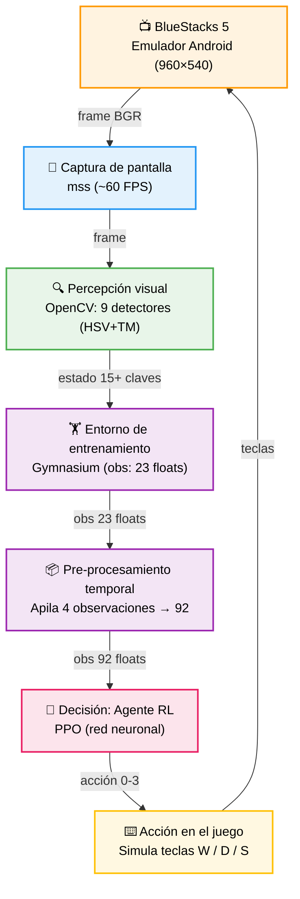
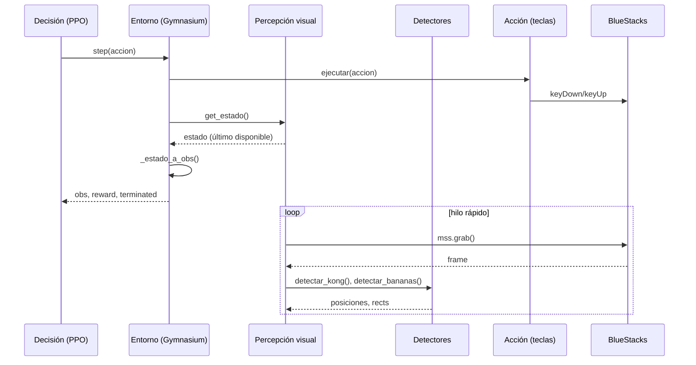
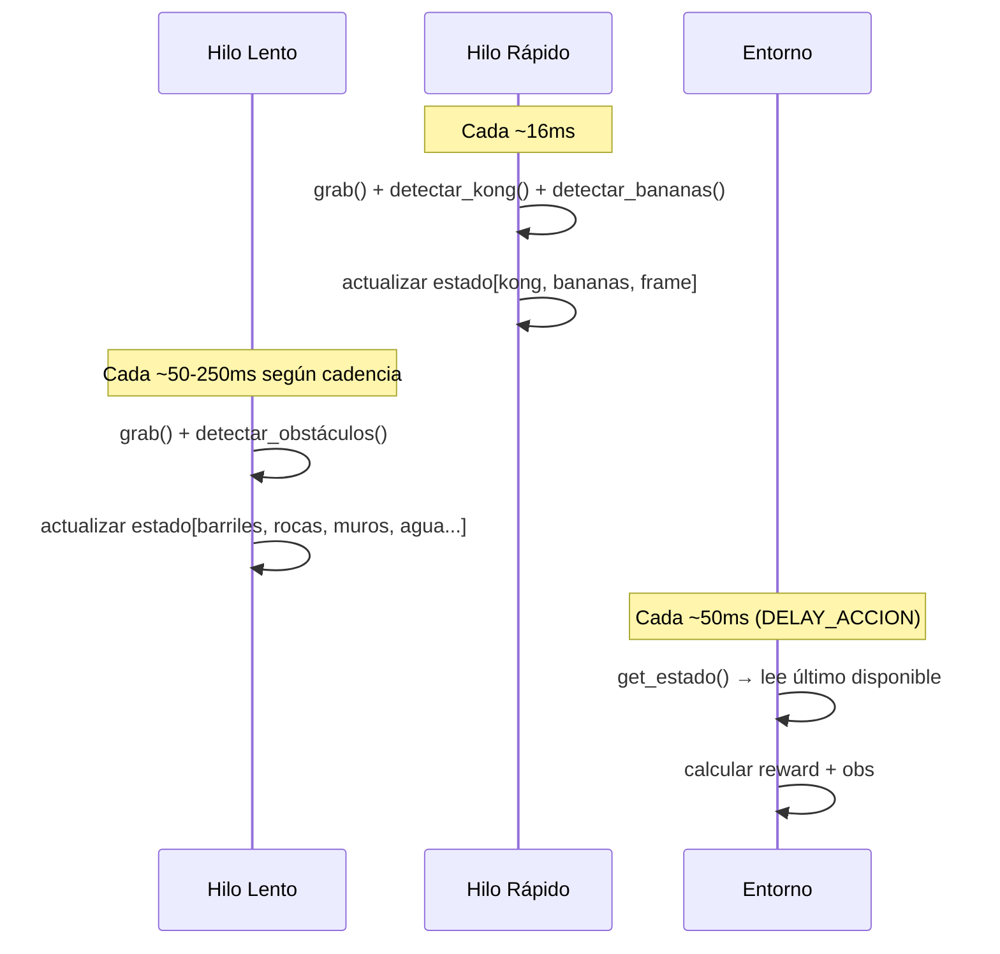

# Bot Autónomo para Banana Kong - Aprendizaje por Refuerzo

**Universidad del Norte - Facultad de Ingeniería de Sistemas**  
**Proyecto Final - Grupo 6 - Aprendizaje por Refuerzo**  
**Kidman Cabana, Santiago Romero - Barranquilla, Colombia - 2026**

---

## Tabla de Contenidos

1. [Introducción](#1-introducción)
2. [Marco Conceptual](#2-marco-conceptual)
3. [Planteamiento del Problema](#3-planteamiento-del-problema)
4. [Objetivos](#4-objetivos)
5. [Estado del Arte](#5-estado-del-arte)
6. [Requerimientos](#6-requerimientos)
7. [Diseño y Arquitectura](#7-diseño-y-arquitectura)
8. [Implementación](#8-implementación)
9. [Despliegue y Operación](#9-despliegue-y-operación)
10. [Validación](#10-validación)
11. [Resultados y Discusión](#11-resultados-y-discusión)
12. [Referencias](#12-referencias)

---

## 1. Introducción

Banana Kong es un videojuego de plataformas y carrera continua (*endless runner*) desarrollado por FDG Entertainment, disponible para plataformas móviles Android e iOS. El juego presenta a un gorila que debe desplazarse por una selva tropical recolectando plátanos, esquivando obstáculos y utilizando animales de apoyo para avanzar. Su espacio de acciones reducido (salto y planeo, dash y agacharse) lo convierte en un candidato adecuado para el entrenamiento de un agente basado en aprendizaje por refuerzo, dado que las decisiones son discretas y el entorno es visualmente consistente dentro de un mismo mundo.

Este proyecto construyó un agente autónomo que percibe el juego exclusivamente a través de la pantalla y ejecuta acciones simulando entradas de teclado, sin acceso a la memoria del juego ni modificación del APK. El módulo de percepción utiliza visión por computador con OpenCV, implementando detectores especializados por tipo de objeto mediante estrategias híbridas de segmentación HSV y template matching. El módulo de decisión utiliza PPO (Proximal Policy Optimization) implementado con Stable-Baselines3, un algoritmo de gradiente de política con buena estabilidad de entrenamiento para espacios de acción discretos pequeños.

El proyecto completó un pipeline funcional de extremo a extremo: captura de pantalla, detección de nueve tipos de objetos, entorno Gymnasium, entrenamiento con PPO y reinicio automático de episodios. Dos sesiones de entrenamiento independientes de 500.000 pasos cada una, con distintas configuraciones de hiperparámetros, produjeron agentes con recompensas promedio finales de 19.06 y 17.98, superando la meta establecida de ep_rew_mean ∈ [10, 15].

---

## 2. Marco Conceptual

### 2.1 Aprendizaje por Refuerzo

El aprendizaje por refuerzo (RL, *Reinforcement Learning*) es una rama del aprendizaje automático en la que un agente aprende a tomar decisiones mediante la interacción con un entorno. En cada paso de tiempo, el agente observa el estado del entorno, selecciona una acción, recibe una recompensa numérica y transiciona a un nuevo estado. El objetivo del agente es maximizar la recompensa acumulada a lo largo del tiempo, conocida como retorno. A diferencia del aprendizaje supervisado, no se proporcionan ejemplos de la acción correcta; el agente debe descubrir qué acciones son buenas mediante ensayo y error.

El problema se formaliza como un Proceso de Decisión de Markov (MDP), definido por una tupla (S, A, P, R, γ), donde S es el espacio de estados, A el espacio de acciones, P la función de transición, R la función de recompensa y γ ∈ [0,1] el factor de descuento que pondera la importancia de las recompensas futuras frente a las inmediatas. En este proyecto, el estado corresponde a un vector de 23 valores que describe la posición de Kong, los obstáculos visibles y su distancia relativa; las acciones son las cuatro teclas de control del juego; y la recompensa es positiva por recolectar bananas y negativa por morir.

### 2.2 Proximal Policy Optimization (PPO)

PPO es un algoritmo de gradiente de política propuesto por Schulman et al. (2017) que entrena directamente la política del agente (la función que mapea estados a acciones) mediante descenso de gradiente estocástico. Su principal innovación es una función de pérdida con recorte (*clip*) que limita el cambio en la política en cada actualización, evitando actualizaciones demasiado grandes que podrían desestabilizar el aprendizaje. Esta propiedad lo hace más robusto que sus predecesores (TRPO, A3C) y es una de las razones por las que se ha convertido en el algoritmo de referencia para tareas con espacios de acción discretos pequeños.

PPO es un algoritmo *on-policy*: aprende de la experiencia generada por la política actual y descarta esa experiencia después de cada actualización. Esto lo hace menos eficiente en términos de muestras que los algoritmos *off-policy* como DQN, pero más estable y más fácil de ajustar. En este proyecto se utilizó la implementación de Stable-Baselines3, que incluye soporte para entornos Gymnasium, guardado de checkpoints y registro de métricas en TensorBoard.

### 2.3 Visión por Computador para Detección de Objetos

La visión por computador es el campo de la inteligencia artificial que permite a las máquinas interpretar y comprender imágenes digitales. En este proyecto se emplearon dos técnicas complementarias: segmentación por color en el espacio HSV y template matching.

La segmentación HSV (*Hue, Saturation, Value*) convierte la imagen de BGR a un espacio de color donde el matiz (H) está separado de la luminosidad (V), lo que permite definir rangos de color robustos ante variaciones de iluminación. Se aplica una máscara binaria para aislar los píxeles que pertenecen al color objetivo y se extraen contornos para identificar regiones candidatas.

El template matching es una técnica que busca una imagen de referencia (template) dentro de un frame más grande mediante correlación cruzada normalizada. Se utilizó `TM_CCOEFF_NORMED`, cuyo valor máximo indica la mejor coincidencia, con soporte para máscaras alpha que permiten ignorar el fondo del template durante la correlación. La estrategia híbrida (HSV para filtrar candidatos, template matching para verificar) reduce el espacio de búsqueda y mejora tanto la velocidad como la precisión.

### 2.4 OpenAI Gymnasium

Gymnasium es una librería de Python que define una interfaz estándar para entornos de aprendizaje por refuerzo. Todo entorno implementa los métodos `reset()` (reiniciar el episodio y retornar la observación inicial) y `step(accion)` (ejecutar una acción y retornar la nueva observación, la recompensa, si el episodio terminó y si fue truncado). Esta interfaz permite que cualquier algoritmo de RL compatible, incluyendo todos los de Stable-Baselines3, interactúe con el entorno sin conocer sus detalles internos. En este proyecto, `BananaKongEnv` implementa esta interfaz encapsulando la captura de pantalla, la detección de objetos, el cálculo de recompensas y el reinicio automático del juego.

### 2.5 VecFrameStack

VecFrameStack es un wrapper de Stable-Baselines3 que apila N observaciones consecutivas en una sola, proporcionando al agente información sobre el movimiento y la dinámica del entorno a través del tiempo. Con N=4 y OBS_SIZE=23, el agente recibe 92 valores por step (4 × 23), lo que le permite inferir velocidades y trayectorias de los objetos detectados a partir de la diferencia entre observaciones consecutivas.

---

## 3. Planteamiento del Problema

### 3.1 Descripción del Problema

Los videojuegos comerciales son sistemas de caja negra: no exponen su estado interno mediante APIs públicas. La única información disponible para un agente externo es la imagen renderizada en pantalla. Esto genera una brecha técnica concreta: integrar captura visual, percepción computacional y ejecución de acciones en un pipeline coherente que opere en tiempo real es un problema de ingeniería no trivial, especialmente con hardware académico limitado. En el contexto específico de Banana Kong, el desafío se amplifica porque los objetos relevantes (Kong, barriles, bananas, muros, agua) tienen variaciones visuales significativas según el fondo, la iluminación del nivel y las animaciones en curso.

**Pregunta central:** ¿Es posible diseñar e implementar, bajo restricciones académicas de tiempo y hardware, un agente autónomo basado en aprendizaje por refuerzo que aprenda a jugar Banana Kong en un emulador Android para PC, utilizando únicamente información visual y simulación de entradas de teclado, alcanzando una recompensa promedio por episodio (`ep_rew_mean`) entre 10 y 15?

Un desafío adicional identificado durante el desarrollo fue que alcanzar recompensas más ambiciosas (ep_rew_mean > 20) de forma consistente requeriría entrenamientos superiores al millón de pasos. Los resultados finales superaron la meta original, con ep_rew_mean de 19.06 y 17.98 en los dos experimentos de 500.000 pasos, lo que motivó ajustar la meta a ep_rew_mean ∈ [15, 20] para el informe final.

### 3.2 Restricciones y Supuestos

**Restricciones técnicas:**

- **Sin acceso interno al juego:** El sistema trata Banana Kong como caja negra. No se lee ni modifica la memoria del proceso, ni se inyecta código en el emulador.
- **Captura exclusivamente visual:** Toda la información del estado proviene de capturas de pantalla con `mss`. No se usa audio, tráfico de red ni otras fuentes.
- **Acciones mediante teclado simulado:** Las interacciones se ejecutan a través de `pyautogui` simulando las teclas configuradas en BlueStacks Game Controls. No se usa ADB por problemas de latencia y conflicto con eventos táctiles.
- **Resolución fija 960×540:** Todos los detectores están calibrados para esta resolución.
- **Latencia objetivo:** El ciclo completo captura → percepción → decisión → acción debe completarse en menos de 100 ms.
- **Hardware de consumo:** Desarrollo en equipos con GPU NVIDIA de gama media. Sin clústeres ni instancias cloud.

**Restricciones del entorno de juego:**

- **Meta de rendimiento:** El agente debe alcanzar una recompensa promedio por episodio (`ep_rew_mean`) entre 15 y 20. Se adopta esta métrica en lugar del puntaje del juego porque el puntaje está influenciado por multiplicadores y power-ups que el agente no controla, mientras que la recompensa es completamente observable, reproducible y alineada con lo que el agente realmente optimiza.
- **Restricción de mundos alternativos:** El agente no debe entrar a mundos alternativos accesibles mediante cuevas (mina), zonas de agua o cohetes. Estos mundos invalidan todos los detectores calibrados para el mundo principal.
- **Mundo único:** El agente opera exclusivamente en el mundo de la selva (mundo inicial).
- **Configuración gráfica fija:** La ventana del emulador permanece en primer plano y visible durante toda la ejecución.

**Restricciones normativas:** El proyecto es estrictamente académico y no comercial. No se redistribuye el APK del juego. El bot opera exclusivamente en modalidad de un jugador (offline).

**Supuestos:** Los elementos clave del juego son visualmente distinguibles con las técnicas implementadas en condiciones normales del mundo selva. Los colores, formas y posiciones de los elementos son consistentes entre partidas dentro del mismo mundo.

### 3.3 Alcance

**Incluido:**

- Pipeline completo: captura → percepción → decisión → acción
- Detectores especializados para: Kong, barriles, bananas, agua, muros (madera y piedra), rocas, game over, mina y tubo amarillo
- Entorno compatible con la interfaz OpenAI Gymnasium
- Entrenamiento con PPO usando Stable-Baselines3
- Reinicio automático de episodios
- Comparación de dos configuraciones de hiperparámetros (conservador vs explorador)
- Documentación técnica completa

**Excluido:**

- Soporte para múltiples biomas distintos al mundo selva
- Detección de objetos interactivos opcionales (lianas, trampolines, guacamaya)
- Interfaz gráfica de usuario: la ejecución es por línea de comandos
- Modificación del APK, archivos del emulador o código del juego
- Generalización a múltiples resoluciones o versiones del juego

---

## 4. Objetivos

### General

Diseñar e implementar un agente autónomo basado en aprendizaje por refuerzo profundo que aprenda a jugar Banana Kong en un emulador Android para PC, utilizando exclusivamente información visual de la pantalla y simulación de teclado, alcanzando una recompensa promedio por episodio (`ep_rew_mean`) entre 15 y 20.

### Específicos

1. Implementar un módulo de captura capaz de obtener fotogramas del emulador a mínimo 15 FPS con latencia individual menor a 50 ms.
2. Desarrollar detectores de visión por computador para cada tipo de objeto relevante del juego, calibrados mediante sesiones sistemáticas de ajuste de umbrales HSV, filtros geométricos y template matching, eliminando falsos positivos en condiciones normales del mundo selva.
3. Diseñar y formalizar el entorno Gymnasium con espacio de estados, acciones y función de recompensa.
4. Entrenar al menos un agente PPO durante un mínimo de 500.000 pasos, documentando curvas de aprendizaje.
5. Comparar al menos dos configuraciones de hiperparámetros y seleccionar la de mejor desempeño.
6. Documentar el sistema completo en el repositorio con READMEs, diagramas y resultados de experimentos.

---

## 5. Estado del Arte

### 5.1 Aprendizaje por Refuerzo en Videojuegos

El trabajo de Mnih et al. (2015) con DQN demostró que una red neuronal puede aprender políticas de juego competitivas directamente desde píxeles en juegos de Atari. Esta aproximación requiere grandes volúmenes de experiencia (en el orden de millones de pasos) pero no necesita conocimiento previo sobre la estructura del juego. En este proyecto, procesar píxeles directamente mediante una política CNN fue descartado por las restricciones de hardware: un paso de entrenamiento con entrada visual es aproximadamente 10 veces más costoso computacionalmente que con un vector de características extraídas manualmente.

Schulman et al. (2017) propusieron PPO, algoritmo de gradiente de política con mayor estabilidad de entrenamiento que sus predecesores. PPO limita el cambio en la política en cada actualización mediante una función de pérdida con clip, reduciendo el riesgo de colapso. Esta propiedad fue crítica en este proyecto: experimentos iniciales con `learning_rate=3e-4` mostraron colapso de política alrededor de los 120.000 pasos, problema que se resolvió reduciendo la tasa de aprendizaje y ajustando el coeficiente de entropía para controlar la exploración.

OpenAI Five (2019) y AlphaStar de DeepMind (2019) demostraron que los agentes de RL pueden alcanzar nivel de experto humano en juegos complejos, pero con recursos computacionales que exceden completamente el alcance académico. Estos trabajos son relevantes no por ser replicables en este contexto, sino porque establecen el límite superior de lo alcanzable con RL en videojuegos y confirman que la brecha entre un agente funcional y uno de nivel experto es fundamentalmente una cuestión de escala computacional.

### 5.2 Bots para Endless Runners

Tutoriales como el de detección de objetos en videojuegos de LearnCodeByGaming (2020) usaron visión por computador con OpenCV para localizar elementos en pantalla mediante template matching y segmentación HSV, sin aprendizaje automático. Lograron tiempos de supervivencia superiores al jugador promedio pero con robustez limitada. La principal debilidad de este enfoque es que las reglas de evasión deben codificarse manualmente. El enfoque híbrido adoptado en este proyecto (percepción clásica combinada con RL) mantiene la confiabilidad de la detección visual mientras permite que el comportamiento de evasión emerja del aprendizaje.

### 5.3 Vacíos Abordados

La literatura muestra escasez de implementaciones reproducibles de agentes RL visuales para juegos móviles en emulador. La mayoría de los trabajos publicados operan sobre juegos de Atari o entornos sintéticos con acceso al estado interno. Este trabajo aborda el caso más restrictivo de un juego comercial de caja negra donde toda la información debe extraerse visualmente. La combinación de detección HSV y template matching como preprocesamiento para reducir el espacio de búsqueda antes del matching es una contribución práctica: en lugar de buscar templates sobre el frame completo, se usan filtros de color para identificar candidatos y se aplica template matching solo sobre esos recortes, logrando una aceleración de 10-50x en la detección.

---

## 6. Requerimientos

### 6.1 Funcionales

| ID | Requerimiento |
|----|--------------|
| RF-01 | Capturar fotogramas del emulador a mínimo 15 FPS |
| RF-02 | Detectar posición de Kong, barriles, bananas, muros, rocas, agua, mina y tubo en cada frame |
| RF-03 | Detectar fin de episodio (game over) con máximo 1s de latencia |
| RF-04 | Reiniciar el juego automáticamente al final de cada episodio |
| RF-05 | Exponer entorno compatible con OpenAI Gymnasium (step, reset, render) |
| RF-06 | Entrenar agente PPO y guardar checkpoints periódicos |
| RF-07 | Registrar métricas de entrenamiento en logs para TensorBoard |
| RF-08 | Ejecutar acciones mediante teclas configuradas en BlueStacks |

### 6.2 No Funcionales

| ID | Requerimiento |
|----|--------------|
| RNF-01 | Ciclo completo captura → decisión → acción < 100 ms (90% de los casos) |
| RNF-02 | Captura sostenida ≥ 15 FPS durante sesiones de más de 30 minutos |
| RNF-03 | Sistema ejecutable con un solo comando desde terminal |
| RNF-04 | Código organizado en módulos independientes con docstrings |
| RNF-05 | Compatible con Windows 10/11, Python 3.9+, BlueStacks 5 |

---

## 7. Diseño y Arquitectura

### 7.1 Evaluación de Alternativas

**Módulo de percepción:**

| Criterio | CNN end-to-end | HSV pura | HSV + Template (elegido) |
|---|---|---|---|
| Falsos positivos | ++ (bajo con suficientes datos) | -- (alto: confunde objetos del mismo color) | + (bajo: TM filtra candidatos) |
| Latencia por frame | ~50 ms (en GPU) | ~5 ms | ~8–15 ms |
| Hardware requerido | GPU dedicada | CPU | CPU |
| Ingeniería manual | No requiere | Umbrales HSV por objeto | Umbrales HSV + templates por objeto |
| Pasos de entrenamiento | ~10⁷ (Atari, Mnih et al. 2015) | N/A (heurístico) | N/A (heurístico) |
| Escalabilidad a nuevos objetos | Alta (re-entrenar red) | Baja (nuevos umbrales) | Media (nuevo template + umbrales) |

El procesamiento directo de píxeles con CNN tiene la ventaja de no requerir ingeniería manual de características pero demanda ~10⁷ pasos de entrenamiento incluso para juegos simples. La segmentación HSV pura es rápida (~5 ms por frame) pero genera falsos positivos en objetos que comparten colores con el fondo selvático. El enfoque híbrido HSV + template matching combina la velocidad del filtrado por color con la precisión del matching (~3–10 ms adicionales), eliminando la mayoría de falsos positivos sin necesidad de GPU.

**Algoritmo de RL:**

| Criterio | DQN | A3C | PPO (elegido) |
|---|---|---|---|
| Tipo | Off-policy | On-policy (async) | On-policy |
| Estabilidad de entrenamiento | -- (sensible a hiperparámetros) | + (estable con muchos workers) | ++ (clip evita colapsos) |
| Workers requeridos | 1 | Varios (típ. 8–16) | 1 |
| Sample efficiency | ++ (reusa experiencias) | + | -- (descarta experiencia) |
| Disponible en Stable-Baselines3 | Sí | No | Sí |
| Idoneidad para 4 acciones discretas | + | + | ++ (reportado en literatura) |
| Recompensas dispersas | -- (dificultad para propagar) | + | + (estable) |

DQN puede converger más rápido por ser off-policy, pero es más sensible a hiperparámetros y menos estable con recompensas dispersas. A3C requiere múltiples workers paralelos, lo que complica la implementación con una sola instancia del emulador. PPO fue seleccionado por su estabilidad documentada (Schulman et al., 2017), disponibilidad en Stable-Baselines3 y buen desempeño reportado en tareas con espacios de acción discretos pequeños.

**Simulación de controles:**

| Criterio | ADB | Gestos drag (pyautogui) | Teclas Game Controls (elegido) |
|---|---|---|---|
| Latencia media | ~200 ms | ~50 ms | ~5 ms |
| Tap accidental al iniciar drag | No | Sí (BS interpreta como tap) | No (gesto nativo SWIPE) |
| Configuración requerida | USB/WiFi + depuración USB | Game Controls drag | Game Controls SWIPE + Tap |
| Dependencia externa | adb.exe en PATH | pyautogui | pyautogui |

ADB presentó latencias de ~200 ms que comprometían el cumplimiento de RNF-01 (ciclo < 100 ms). Los gestos táctiles mediante `pyautogui.drag` causaban que BlueStacks interpretara el inicio del gesto como un tap, haciendo saltar a Kong antes del dash. La solución definitiva fue configurar cada acción como un control SWIPE en BlueStacks Game Controls, eliminando la necesidad de simular gestos y reduciendo la latencia a ~5 ms.

**Arquitectura del pipeline de percepción:**

| Criterio | Hilo único | 2 hilos daemon (elegido) |
|---|---|---|
| Throughput Kong + Bananas | Bajo (compite con 7 detectores más) | **33–38 FPS** (medido, ver sección 10.1) |
| Throughput obstáculos | Bajo | **20–22 FPS** c/cadencia 2 (medido, ver sección 10.1) |
| Estado disponible para el agente | No si un detector lento se ejecuta | **Sí, siempre** (lectura sin espera) |
| Complejidad de implementación | Baja | Media (Lock, daemon join, cadencias) |

En pruebas iniciales con un solo hilo ejecutando los 9 detectores en serie, el throughput era de ~11 FPS, insuficiente para el mínimo de 15 FPS establecido. La separación en dos hilos con cadencias configurables elevó el FPS del hilo rápido a 33–38 y del hilo lento a 20–22, ambos por encima del mínimo requerido.

**Representación del estado (observación):**

| Criterio | Píxeles raw (CNN) | Vector de 23 features (elegido) |
|---|---|---|
| Dimensión | 960 × 540 × 3 ≈ 1.5 × 10⁶ | 23 |
| Pasos de entrenamiento estimados | ~10⁷ (Mnih et al., 2015) | ~5 × 10⁵ (este proyecto) |
| Política requerida | CnnPolicy (más parámetros) | MlpPolicy (menos parámetros) |
| Hardware para entrenar | GPU recomendada | CPU suficiente |
| Interpretabilidad de features | Baja (caja negra) | Alta (cada feature tiene significado) |
| Tiempo de inferencia | ~10–20 ms (GPU) | ~1–2 ms (CPU) |

Entrenar una política directamente desde píxeles requeriría ~10⁷ pasos y una CNN con GPU. Dado que el hardware disponible era CPU y el presupuesto de entrenamiento era de ~500.000 pasos, se optó por un vector de 23 features extraídas manualmente. Esto permitió usar una `MlpPolicy` liviana (~1 ms de inferencia) y reducir las muestras necesarias en ~20× respecto a un enfoque end-to-end.

### 7.2 Arquitectura

#### 7.2.1 Descripción General

El sistema sigue una arquitectura de pipeline secuencial con paralelismo interno. No existe cliente ni servidor: todos los componentes corren en el mismo proceso Python sobre Windows, con hilos daemon para las tareas de detección y visualización. La arquitectura está organizada en cuatro capas: captura, percepción, decisión y acción. Cada capa tiene una responsabilidad única y se comunica con la siguiente a través de interfaces bien definidas, lo que permite probar y sustituir componentes de forma independiente.

El Perceptor es el núcleo del sistema: recibe el frame capturado por `mss`, lo distribuye a los detectores y publica el estado resultante para que el entorno Gymnasium lo consuma. La separación en hilo rápido (Kong y bananas, cada frame) y hilo lento (obstáculos costosos, cada 2-5 frames) fue una decisión de diseño clave para mantener el FPS del pipeline por encima del mínimo requerido.

#### 7.2.2 Componentes del Sistema e Interacción

##### 7.2.2.1 Descripción de Componentes

**Módulo de captura (`mss`):** Captura fotogramas de la ventana de BlueStacks a ~60 FPS usando la API de Windows GDI. Es el punto de entrada del pipeline. Cumple RF-01 y es el único componente con acceso directo a la pantalla.

**Detectores (`deteccion/`):** Nueve módulos independientes, uno por tipo de objeto. Cada detector implementa `detectar_<objeto>(frame)` y retorna la posición del objeto, su bounding box y un frame anotado para depuración. Cumplen RF-02. Los detectores de Kong y bananas corren en el hilo rápido; los demás en el hilo lento.

**Perceptor (`entorno/perceptor.py`):** Coordina los detectores en dos hilos daemon protegidos por `threading.Lock()`. Publica el estado como un diccionario con 15+ claves que incluyen posiciones, bounding boxes y flags de presencia. Implementa la detección de colisiones bananas-Kong por comparación de bounding boxes. Cumple RNF-01 al evitar que el agente espere a los detectores.

**Entorno Gymnasium (`entorno/entorno.py`):** Implementa `BananaKongEnv` con la interfaz estándar `step()` / `reset()`. Convierte el estado del Perceptor en un vector de observación de 23 floats, calcula la recompensa y detecta la terminación del episodio. Cumple RF-05.

**Agente PPO (`entrenamiento/entrenar.py`):** Instancia el modelo `PPO("MlpPolicy")` de Stable-Baselines3 con `VecFrameStack(n=4)`, que apila 4 observaciones consecutivas dando al agente información temporal. Gestiona checkpoints, logs de TensorBoard y continuación de entrenamientos previos. Cumple RF-06 y RF-07.

**Módulo de acciones (`controles/acciones.py`):** Traduce las acciones discretas (0-3) a llamadas `pyautogui.keyDown` / `keyUp`. Mantiene el estado de la tecla W para controlar la duración del planeo. Cumple RF-08.

La **Fig. 1** ilustra cómo estos componentes se conectan en el pipeline de datos.

**Fig. 1.** *Arquitectura del pipeline de captura a acción.*




#### 7.2.2.2 Componentes del Pipeline

| Capa | Componente | Tecnología | Entrada | Salida |
|---|---|---|---|---|
| **Captura** | mss | Windows GDI | Ventana BlueStacks | frame BGR 960×540 |
| **Percepción** | Perceptor (hilo rápido) | OpenCV + CSRT | frame | Kong (cx,cy,pose), Bananas (cantidad, rects) |
| **Percepción** | Perceptor (hilo lento) | OpenCV + Template | frame | Barriles, Rocas, Muros, Agua, Mina, Tubo, GameOver |
| **Entorno** | BananaKongEnv | Gymnasium | estado dict + acción | obs (23 floats), reward, terminated |
| **Pre-procesamiento** | VecFrameStack | Stable-Baselines3 | obs 23 floats | obs apilada 92 valores (4 frames) |
| **Decisión** | Agente PPO | Stable-Baselines3 | obs 92 floats | acción discreta (0-3) |
| **Acción** | pyautogui | Windows input | acción 0-3 | keyDown/Up (W, D, S) |

#### 7.2.2.3 Detalle de Detectores

| Detector | Estrategia | ROI | Umbrales / Filtros | Cadencia | Optimización |
|---|---|---|---|---|---|
| **Kong** | HSV + Template + CSRT Tracker + anti-drift | (80,0)-(420,510) | HSV [5-25, 80-170, 50-180], área 400-3500, ratio 0.4-2.5, umbral TM 0.65, verificación color >8% | Cada frame | Tracker CSRT evita re-detección costosa; anti-drift cada 25 frames con distancia máx 80px |
| **Bananas** | HSV + filtros geométricos + solidez | (160,60)-(960,510) | HSV [20-32, 180-255, 140-255], área 40-200, ratio 0.5-4, solidez convex hull >0.6 | Cada frame | Kong masking: se enmascara bbox de Kong antes de buscar para evitar falsos positivos |
| **Barriles** | HSV + Template (4 templates) | (195,80)-(900,480) | HSV [8-22, 120-240, 160-255], área 600-1400, ratio 0.9-1.4, solidez >0.60, umbral TM 0.73 | Configurable (cada 2 frames en producción) | ROI excluye tercio izquierdo (zona de Kong); calibración: área máx reducida de 6000→1400 |
| **Agua** | HSV puro | (0,300)-(960,510) | HSV [85-97, 120-210, 150-230], área mínima 2000 | Configurable (cada 3 frames en producción) | Posición horizontal ponderada por área de cada zona de agua |
| **Rocas** | Template matching (2 templates) | (140,0)-(960,510) | Umbral TM 0.7, non-maximum suppression dist. mín. 50px, 3 escalas [0.9, 1.0, 1.1] | Configurable (cada 3 frames en producción) | Resize a 50% → 4x reducción en píxeles a procesar |
| **Muros** | Doble HSV (madera + piedra) + Template | (180,0)-(960,510) | Madera: HSV [5-22, 150-255, 60-255], ratio h/w 1.2-4.0. Piedra: HSV [0-25, 40-130, 110-255], ratio h/w 1.8-7.0. Solidez >0.45, umbral TM 0.6 | Configurable (cada 3 frames en producción) | S_min=150 en madera excluye troncos del fondo (S~100-120); 9 escalas de matching |
| **Mina** | Template matching (1 template) | (0,300)-(960,510) | Umbral TM 0.65, 5 escalas [0.8-1.2] | Configurable (cada 5 frames en producción) | Resize a 50%; ROI restringido a zona inferior donde aparece la mina |
| **Tubo** | Template matching (1 template) | (0,300)-(960,510) | Umbral TM 0.8 (alto, selectivo), 5 escalas [0.8-1.2] | Configurable (cada 5 frames en producción) | Resize a 50%; umbral deliberadamente alto porque entrar al mundo submarino invalida todos los detectores calibrados |
| **Game Over** | Template matching sobre ROI central | (200,100)-(760,400) | Umbral TM 0.60, 3 escalas [0.9, 1.0, 1.1] | Cada 10 frames | Template solo del texto "Revive?" (sin número de vidas) para ser invariante a vidas restantes |

#### 7.2.2.4 Mecanismos Anti-Falsos Positivos

| Mecanismo | Detector(es) | Descripción |
|---|---|---|
| **Masking de Kong** | Bananas | Se pinta de negro el bbox de Kong antes de buscar bananas, evitando confundir pelaje marrón con banana |
| **ROI excluyente** | Barriles, Muros | El ROI de barriles empieza en x=195 (excluye zona de Kong); muros en x=180 por la misma razón |
| **Umbral alto selectivo** | Tubo (0.8) | Umbral deliberadamente más alto que el resto porque entrar al mundo submarino invalida todos los detectores calibrados |
| **Verificación anti-drift** | Kong | Cada 25 frames se valida que el bbox del tracker contenga >8% píxeles color Kong; si no, se re-inicializa con HSV+Template (umbral 0.80) |
| **Solidez convex hull** | Bananas, Barriles, Muros | Se rechazan blobs irregulares con solidez <0.6 (bananas/barriles) o <0.45 (muros), filtrando ruido del fondo |
| **Filtro por saturación** | Muros (madera) | S_min=150 excluye troncos y elementos del fondo que tienen saturación más baja (S~100-120) |
| **Calibración de área** | Barriles | BARRIL_AREA_MAX reducido de 6000 a 1400 tras identificar que falsos positivos tenían área sistemáticamente mayor |
| **Non-maximum suppression** | Rocas | Elimina detecciones duplicadas manteniendo solo la de mayor confianza dentro de un radio de 50px |

Las cadencias de los detectores del hilo lento son configurables mediante atributos del `Perceptor` (`AGUA_CADA`, `BARRILES_CADA`, `ROCAS_CADA`, `MUROS_CADA`, `MINA_CADA`, `TUBO_CADA`). Los valores por defecto en producción asignan mayor frecuencia a objetos comunes y dinámicos (barriles cada 2 frames, agua/rocas/muros cada 3 frames) y menor frecuencia a objetos raros o estáticos (mina y tubo cada 5 frames). Game Over se verifica cada 10 frames dado que la pantalla de revive permanece visible varios segundos. Esta configuración permite balancear la carga computacional del hilo lento según la criticidad de cada detector.

##### 7.2.2.5 Interacción entre Módulos

El flujo de datos es unidireccional en su mayoría: la captura alimenta al Perceptor, el Perceptor alimenta al entorno, y el entorno alimenta al agente. La única comunicación inversa es la acción del agente que, a través del módulo de acciones, modifica el estado de BlueStacks y por tanto el próximo frame capturado.

El Perceptor y el entorno están desacoplados mediante el patrón productor-consumidor: el Perceptor actualiza el estado continuamente en background y el entorno lee el último estado disponible al momento de cada `step()`, sin bloquearse. Esta separación es lo que permite al agente operar a ~5 FPS aunque los detectores corran más lento.

La **Fig. 2** detalla la secuencia de llamadas entre componentes durante un paso del agente.

**Fig. 2.** *Secuencia de interacción entre módulos durante un paso del agente.*



##### 7.2.2.6 Comportamiento

El flujo principal es eficiente: el agente no espera a los detectores lentos porque el Perceptor siempre tiene un estado disponible. El principal cuello de botella es BlueStacks mismo (el rendering del juego limita la tasa de frames útiles a ~10-15 FPS, por debajo de la cual el agente recibe observaciones repetidas.

La latencia del ciclo completo captura → decisión → acción es de aproximadamente 50-70 ms, dentro del umbral de 100 ms establecido. Los detectores del hilo lento tienen latencias de 100-250 ms para mina y tubo (cadencia de 5 frames), pero esto es aceptable porque estos objetos aparecen con poca frecuencia y su posición no cambia rápidamente.

La **Fig. 3** ilustra la separación temporal entre los hilos rápido y lento, con sus respectivas cadencias.

**Fig. 3.** *Separación temporal entre los hilos de percepción.*




---

## 8. Implementación

### 8.1 Stack Tecnológico

| Tecnología | Rol | Justificación |
|-----------|-----|--------------|
| Python 3.9+ | Lenguaje principal | Ecosistema RL maduro |
| OpenCV | Visión por computador | Template matching, HSV, contornos |
| mss | Captura de pantalla | ~60 FPS, menor latencia que PIL |
| Stable-Baselines3 | Algoritmo PPO | Implementación robusta y documentada |
| Gymnasium | Interfaz entorno | Estándar de la industria para RL |
| pyautogui | Simulación de teclado | Compatible con BlueStacks en Windows |
| BlueStacks 5 | Emulador Android | Game Controls con teclas personalizables |
| TensorBoard | Monitoreo | Curvas de aprendizaje en tiempo real |

### 8.2 Componentes

**Detectores de visión por computador:** Cada tipo de objeto tiene su propio módulo en `deteccion/`. La estrategia es híbrida HSV + template matching para la mayoría, excepto el game over (template matching puro sobre ROI pequeño) y el agua (HSV puro). Los templates son PNG con canal alpha real usado como máscara en `cv2.matchTemplate(..., mask=alpha)`. Se usa `TM_CCOEFF_NORMED` por ser robusto ante variaciones de brillo. Los detectores de rocas y mina trabajan a mitad de resolución (`FACTOR_RESIZE=0.5`) para reducir el tiempo de procesamiento en ~4x. Durante el desarrollo se realizaron sesiones de calibración sistemática registrando área, ratio, solidez y confianza de cada detección para ajustar umbrales.

**Perceptor:** Implementa dos hilos daemon separados. El hilo rápido captura y procesa Kong y bananas en cada iteración, garantizando que la posición del personaje principal siempre esté actualizada. El hilo lento procesa barriles (cada 2 frames), agua, rocas y muros (cada 3 frames) y mina y tubo (cada 5 frames). Todas las variables compartidas se protegen con `threading.Lock()`. Un tercer hilo de display muestra bounding boxes en tiempo real a escala 50%.

**Entorno Gymnasium:** El vector de observación contiene 23 floats normalizados en [0,1]. Para cada obstáculo se incluye un flag de presencia (0/1) más coordenadas relativas a Kong centradas en 0.5, resolviendo la ambigüedad de usar 0.0 como valor por defecto (que el modelo podría interpretar como "obstáculo en la esquina"). La recompensa es +0.05 por step de supervivencia y +1.0 por banana recogida. La penalización por game over es -10.0. El reinicio automático usa template matching para las pantallas de "Revive" y "Play Again", con fallback de tecla W.

**VecFrameStack:** Se aplica con N=4, apilando cuatro observaciones consecutivas (4 × 23 = 92 valores). Esto le proporciona al agente información sobre la dinámica temporal del entorno sin aumentar la complejidad del modelo.

**Módulo de entrenamiento:** Soporta dos modos: nuevo entrenamiento y continuación (`--continuar`). Guarda el `run_id` en un archivo `.run_id_actual` para recuperar el directorio de logs correcto al continuar, garantizando que TensorBoard muestre una sola curva continua. Los checkpoints se guardan cada 10.000 pasos en `modelos/checkpoints/run_<id>/`.

### 8.3 Integraciones

La única integración externa es BlueStacks como emulador Android, con comunicación exclusivamente a través de captura de pantalla (`mss`) y simulación de teclado (`pyautogui`). No hay APIs externas ni bases de datos. Los modelos se guardan como archivos `.zip` de Stable-Baselines3 y los logs en formato TensorBoard en `logs/run_<id>/tensorboard/`.

---

## 9. Despliegue y Operación

### 9.1 Requisitos del Sistema

- Windows 10/11
- Python 3.9 o superior
- BlueStacks 5 instalado
- Procesador moderno (el entrenamiento corre en CPU; la percepción OpenCV también)

### 9.2 Instalación

**1. Clonar el repositorio**

```bash
git clone https://github.com/KidmanC/KongBot-Agente-Aut-nomo-para-Banana-Kong-mediante-Aprendizaje-por-Refuerzo
```

**2. Crear entorno virtual e instalar dependencias**

```bash
python -m venv .venv
```

Activar el entorno virtual:

- **Windows:**
  ```bash
  .venv\Scripts\activate
  ```
- **Mac/Linux:**
  ```bash
  source .venv/bin/activate
  ```

Instalar dependencias:

```bash
pip install -r requirements.txt
```

### 9.3 Configuración de BlueStacks

#### Instalar el juego

El APK de Banana Kong se puede descargar desde el siguiente enlace:

> **[Descargar Banana Kong APK](#)** *(link pendiente)*

Una vez descargado, instálalo directamente en BlueStacks arrastrando el archivo `.apk` sobre la ventana del emulador. Esto evita tener que iniciar sesión en Google Play Store.

#### Importar configuración de controles

El archivo `com.fdgentertainment.bananakong.cfg` en la raíz del repositorio contiene la configuración de controles exportada de BlueStacks. Para importarla:

1. Abre BlueStacks → **Configuración → Importar/Exportar configuración de controles**
2. Selecciona el archivo `.cfg`
3. Reinicia BlueStacks

> Si prefieres configurar los controles manualmente, sigue las instrucciones de la sección **Controles** más abajo.

#### Resolución

La resolución debe ser exactamente **960×540**:

1. Abre BlueStacks → **Configuración → Display**
2. Resolución: `960 × 540`
3. DPI: `240`
4. Guarda y reinicia BlueStacks

#### Desactivar anuncios

> **Importante:** Los anuncios de BlueStacks modifican el tamaño de la ventana de juego, lo que desplaza los ROIs de todos los detectores y causa fallos en la detección.

1. Abre BlueStacks → **Configuración → Preferencias**
2. Busca la opción **"Permitir que BlueStacks muestre anuncios"**
3. **Desactívala**
4. Reinicia BlueStacks

#### Controles

Dentro del juego, abre el **Game Controls** (ícono de teclado en la barra lateral de BlueStacks). La configuración **no se hace tecla por tecla**, se usa un control de tipo **SWIPE**:

1. En el editor de controles, busca el item **SWIPE** y arrástralo a la pantalla
2. Configura los siguientes gestos:

| Gesto | Tecla | Acción en el juego |
|-------|-------|-------------------|
| Deslizar derecha | `D` | Dash (impulso hacia adelante) |
| Deslizar abajo | `S` | Bajar / Deslizarse |

3. Para la tecla `W` (Saltar / Planear), agrega un control de tipo **Tap** y mapealo en la **parte inferior derecha de la pantalla**, donde Kong salta al tocar.

> **¿Por qué SWIPE y no teclas individuales?** BlueStacks interpreta el inicio de cualquier drag como un tap, lo que hacía que Kong saltara antes de ejecutar el dash. Usar un control SWIPE nativo separa correctamente el gesto de salto del gesto de dash.

### 9.4 Templates

Los archivos PNG con canal alpha deben colocarse en `deteccion/templates/`. Los archivos requeridos son:

| Categoría | Archivos |
|---|---|
| **Kong** | `kong_inicio-bg.png`, `kong_corriendo1-bg.png`, `kong_corriendo2-bg.png`, `kong_corriendo3-bg.png`, `kong_saltando-bg.png`, `kong_saltando2-bg.png`, `kong_paracaidas-bg.png`, `kong_dash-bg.png`, `kong_liana-bg.png`, `kong_guacamaya-bg.png` |
| **Barriles** | `barril-bg.png`, `barril2-bg.png`, `barril3-bg.png`, `barril4-bg.png`, `barril_danado-bg.png` |
| **Muros** | `muro_madera-bg.png`, `muro_piedra-bg.png` |
| **Rocas** | `roca1-bg.png`, `roca2-bg.png` |
| **Mina/Tubo** | `mina-bg.png`, `tubo-bg.png` |
| **Game Over** | `revive_texto.png`, `flecha.png`, `play_again.png` |

### 9.5 Estructura del Proyecto

```
├── deteccion/
│   ├── templates/          ← PNGs con canal alpha
│   ├── __init__.py
│   ├── detector_agua.py
│   ├── detector_bananas.py
│   ├── detector_barriles.py
│   ├── detector_gameover.py
│   ├── detector_kong.py
│   ├── detector_mina.py
│   ├── detector_muros.py
│   ├── detector_rocas.py
│   └── detector_tubo.py
│
├── entorno/
│   ├── __init__.py
│   ├── entorno.py
│   ├── perceptor.py
│   └── reward_bananas.py
│
├── entrenamiento/
│   ├── entrenar.py
│   └── evaluar.py
│
├── controles/
│   ├── __init__.py
│   └── acciones.py
│
├── modelos/                ← generado automáticamente (.gitignore)
├── logs/                   ← generado automáticamente (.gitignore)
├── diagramas/              ← PlantUML y PNGs
├── requirements.txt
├── .gitignore
└── README.md
```

### 9.6 Probar Detectores Individualmente

Antes de entrenar, verifica que cada detector funciona correctamente con BlueStacks abierto y el juego corriendo:

```bash
python -m deteccion.detector_kong
python -m deteccion.detector_bananas
python -m deteccion.detector_barriles
python -m deteccion.detector_rocas
python -m deteccion.detector_muros
python -m deteccion.detector_agua
python -m deteccion.detector_mina
python -m deteccion.detector_tubo
python -m deteccion.detector_gameover
python -m entorno.perceptor        # todos los detectores juntos
```

Cada detector abre una ventana con las detecciones en tiempo real. Presiona `q` para cerrar.

### 9.7 Entrenar el Agente

```bash
# Entrenamiento desde cero
python -m entrenamiento.entrenar

# Continuar entrenamiento previo
python -m entrenamiento.entrenar --continuar

# Añadir steps específicos a un entrenamiento existente
python -m entrenamiento.entrenar --continuar --add-steps 100000
```

Los checkpoints se guardan automáticamente en `modelos/checkpoints/` cada 10.000 steps.

### 9.8 Monitorear el Entrenamiento

```bash
tensorboard --logdir logs/
```

Abre `http://localhost:6006` en el navegador para ver las curvas de recompensa en tiempo real.

---

## 10. Validación

### 10.1 Pruebas por Componentes

Cada detector fue probado de forma independiente mediante `python -m deteccion.detector_<nombre>`, que abre una ventana con el frame anotado en tiempo real. Se realizaron sesiones de calibración sistemática en las que se registraron los valores reales de área, ratio, solidez y confianza de cada detección mediante prints de debug. Este proceso permitió ajustar los umbrales HSV, el área mínima de blobs y el umbral de template matching para cada detector. Los detectores de barriles y rocas, por ejemplo, se calibraron reduciendo `BARRIL_AREA_MAX` de 6.000 a 1.400 y subiendo `UMBRAL` de 0.75 a 0.77 tras identificar que los falsos positivos tenían área y confianza sistemáticamente distintos a los verdaderos positivos.

El perceptor completo se verificó con `python -m entorno.perceptor`, que activa todos los detectores simultáneamente y muestra la ventana Debug con las bounding boxes superpuestas. Se comprobó la ausencia de errores en el hilo de detección, la correcta separación entre hilo rápido y lento, y un FPS sostenido por encima de 10 durante sesiones de 5 minutos continuas.

**Métricas de rendimiento del pipeline:**

| Métrica | Requerimiento | Medido | Estado |
|---|---|---|---|
| Hilo rápido (Kong + Bananas) | ≥ 15 FPS | 33-38 FPS | ✅ |
| Hilo lento (obstáculos, cadencia 2) | ≥ 15 FPS | 20-22 FPS | ✅ |

La cadencia de los detectores del hilo lento es configurable (`AGUA_CADA`, `BARRILES_CADA`, etc.). Con todos los detectores configurados en cadencia 2 (cada 2 frames), el hilo lento opera a ~21 FPS, muy por encima del mínimo de 15 FPS requerido. El cuello de botella principal es BlueStacks mismo, que limita los frames útiles a ~10-15 FPS de renderizado.

### 10.2 Pruebas de Integración

La prueba de integración principal fue el entrenamiento completo de 500.000 pasos. Esta prueba verificó que todos los componentes interactúan correctamente: el Perceptor alimenta el entorno, el entorno alimenta el agente PPO, el agente ejecuta acciones en BlueStacks y el entorno detecta el game over y reinicia el episodio. Ambas sesiones de entrenamiento (conservador y explorador) corrieron sin errores críticos, los checkpoints se guardaron correctamente cada 10.000 pasos y las curvas de recompensa mostraron tendencia positiva sostenida.

El reinicio automático de episodios funcionó correctamente en la gran mayoría de los episodios. Los casos de fallo, principalmente cuando el juego no llegaba a la pantalla de revive en el tiempo esperado, fueron manejados por el mecanismo de fallback de tecla W.

### 10.3 Pruebas de Usabilidad

La evaluación formal del agente contra una política aleatoria de referencia (baseline) en 30 episodios con análisis estadístico (t-test p < 0.05) queda como trabajo futuro. Los resultados de entrenamiento obtenidos (ep_rew_mean de 19.06 y 17.98 tras 500.000 pasos) constituyen evidencia cuantitativa del aprendizaje, pero no reemplazan una evaluación controlada contra baseline.

---

## 11. Resultados y Discusión

### 11.1 Experimentos de Entrenamiento

Se realizaron dos sesiones de entrenamiento independientes de 500.000 pasos cada una, comparando dos configuraciones de hiperparámetros:

| Hiperparámetro | Conservador | Explorador |
|---------------|-------------|-----------|
| learning_rate | 7e-5 | 2e-4 |
| n_steps | 2048 | 4096 |
| batch_size | 128 | 256 |
| n_epochs | 10 | 10 |
| clip_range | 0.15 | 0.2 |
| ent_coef | 0.005 | 0.015 |

### 11.2 Resultados

| Métrica | Conservador | Explorador |
|---------|------------|-----------|
| ep_rew_mean final | **19.06** | 17.98 |
| ep_rew_mean máximo | **21.14** | 19.77 |
| ep_rew_mean mínimo | 6.01 | 5.96 |
| Mejora total (Δ%) | **+199%** | +105% |
| Steps totales | 494.096 | 500.480 |

Ambas configuraciones superaron la meta original de ep_rew_mean ∈ [10, 15] y alcanzaron valores dentro del rango ajustado de [15, 20]. El perfil conservador obtuvo el mejor resultado final con 19.06, una mejora del 199% respecto al valor inicial.

### 11.3 Discusión

La diferencia entre ambas configuraciones es consistente con la teoría: el perfil conservador, con menor tasa de aprendizaje y clip_range más bajo, realiza actualizaciones más pequeñas y estables, lo que resultó en mayor mejora acumulada. El perfil explorador, con mayor ent_coef (0.015 vs 0.005), mantiene mayor entropía en la política, lo que favorece la exploración pero puede dificultar la explotación de estrategias ya aprendidas.

Un hallazgo relevante es que ninguna de las dos configuraciones mostró el colapso de política observado en experimentos anteriores con `learning_rate=3e-4`. Esto confirma que las tasas de aprendizaje bajas (7e-5 y 2e-4) son más apropiadas para este entorno.

El vector de observación con flags de presencia para cada obstáculo fue una mejora crítica respecto a la versión anterior, que usaba 0.0 como valor por defecto (lo que el modelo interpretaba como "obstáculo en la esquina superior izquierda"). Esta corrección, junto con la ampliación de la observación a 23 valores incluyendo rocas, muros, mina y tubo, probablemente contribuyó significativamente a los mejores resultados.

---

## 12. Trabajo Futuro

### 12.1 Evaluación Formal contra Baseline

La evaluación del agente contra una política aleatoria de referencia con análisis estadístico (t-test, p < 0.05, 30 episodios) queda pendiente. Si bien las curvas de entrenamiento muestran mejora consistente, una evaluación controlada permitiría cuantificar con significancia estadística la diferencia respecto a un agente que solo presiona teclas al azar.

### 12.2 Detección en Otros Mundos

El agente opera exclusivamente en el mundo selva. Los detectores actuales (HSV + template matching) están calibrados para los colores y formas de ese bioma. En otros mundos del juego cambian las paletas de color, los tilesets y la disposición de obstáculos, lo que invalida los umbrales actuales. Implementar un detector de transición de mundo que pause la detección y recalibre ROIs y umbrales habilitaría al agente para operar en múltiples biomas.

### 12.3 Entrenamiento Prolongado

Las dos sesiones de 500.000 pasos mostraron mejora sostenida sin alcanzar una meseta clara, lo que sugiere que entrenamientos más largos (2–5 millones de pasos) podrían producir mejoras adicionales significativas. La tendencia positiva de `ep_rew_mean` al final de ambas sesiones respalda esta hipótesis.

### 12.4 Detectores Faltantes y Calibración Automática

Del mundo principal quedan sin detectores implementados: lianas (plataformas colgantes que permiten avance estratégico), trampolines (impulsan a Kong a alturas mayores) y la guacamaya (obstáculo volador con trayectoria errática). Agregar estos detectores permitiría al agente usar mecánicas de juego que actualmente ignora.

Además, el pipeline de calibración actual es manual: cada umbral HSV, área mínima y nivel de confianza se ajustó observando detecciones en tiempo real. Un pipeline de calibración automática que ajuste estos parámetros a partir de screenshots etiquetados reduciría el trabajo manual y facilitaría el soporte a múltiples resoluciones y mundos.

---

## 13. Referencias

1. V. Mnih et al., "Human-level control through deep reinforcement learning," *Nature*, vol. 518, pp. 529–533, 2015.
2. OpenAI, "OpenAI Five," 2019. https://openai.com/five
3. O. Vinyals et al., "Grandmaster level in StarCraft II using multi-agent reinforcement learning," *Nature*, vol. 575, pp. 350–354, 2019.
4. J. Schulman et al., "Proximal Policy Optimization Algorithms," arXiv:1707.06347, 2017.
5. V. Mnih et al., "Asynchronous Methods for Deep Reinforcement Learning," *ICML*, 2016.
6. LearnCodeByGaming, "OpenCV Object Detection in Games" [Tutorial series], 2020. https://learncodebygaming.com/blog/tutorial/opencv-object-detection-in-games
7. G. Brockman et al., "OpenAI Gym," arXiv:1606.01540, 2016.
8. A. Raffin et al., "Stable-Baselines3: Reliable Reinforcement Learning Implementations," *JMLR*, vol. 22, 2021.
9. G. Bradski, "The OpenCV Library," *Dr. Dobb's Journal*, 2000.
10. ScreenInfo, "mss: An ultra-fast cross-platform multiple screenshots module," https://python-mss.readthedocs.io
